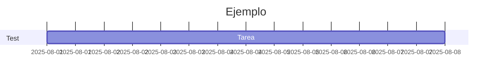
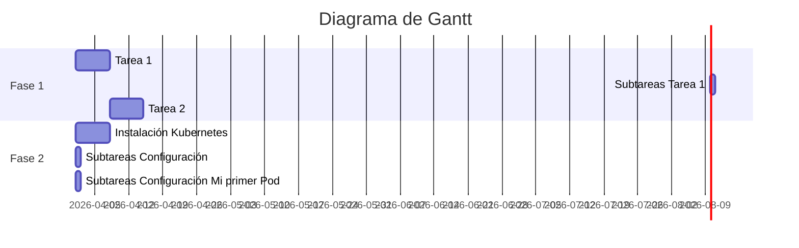

# minecraft

Hola mundo!

> ### DIAGRAMA DE GANTT

```mermaid
gantt
    title Ejemplo
    dateFormat  YYYY-MM-DD
    section Test
    Tarea :2025-08-01, 7d
```

https://mermaid.ai/open-source/syntax/gantt.html

```mermaid
gantt
    title Diagrama de Gantt
    dateFormat DD-MM-YYYY
    section Fase 1
        Tarea 1                                        :a1, 01-04-2026, 7d
        Subtareas Tarea 1                              :after 01-04-2026, 1d
        Tarea 2                                        :after a1, 7d
    section Fase 2
        Instalación Kubernetes                         :01-04-2026, 7d
        Subtareas Configuración                        :01-04-2026, 1d
        Subtareas Configuración Mi primer Pod          :01-04-2026, 1d
```
