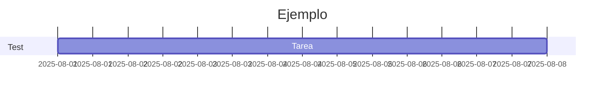

# minecraft

Hola mundo!


> ### DIAGRAMA DE GANTT




https://mermaid.ai/open-source/syntax/gantt.html

```mermaid
gantt
    title Diagrama de Gantt
    dateFormat DD-MM-YYYY
    section Fase 1: Planificación
        Tarea 1 Diagrama de gantt                     :01-04-2026, 7d
        Subtareas Minecraft server                     :01-04-2026, 7d
        Subtareas mermaid                              :01-04-2026, 7d
    section Fase 2: Implementación Minecraft
        Instalación Ubuntu Server 24.06                                   :08-04-2026, 7d
        Instalación Kubernetes                                            :08-04-2026, 7d
        Subtareas primera confuiguración con apuntes                      :08-04-2026, 7d
        Subtareas segundas configuración mi primer minecraft Server       :08-04-2026, 7d
    section Fase 3: Implementación Graphana
        Instalación Ubuntu Server 24.06                                   :08-04-2026, 7d
        Instalación Graphana + Prometheus                                 :08-04-2026, 7d
    section Fase 4: Configuración de red
        Configuración Router                                  :08-04-2026, 7d
        Instalación Firewall (IPTABLES)                     :08-04-2026, 7d
        Instalación Proxy Inverso                           :08-04-2026, 7d
    section Fase 4: Documentación
        Instalación Powerpoint                              :08-04-2026, 7d
        Impresion del documento final Word                  :08-04-2026, 7d
        Artefactos
            Diagrama de Red                                 :08-04-2026, 7d
            Diagrama de Gantt                               :08-04-2026, 7d
            Esquema de servidores Minecraft                 :08-04-2026, 7d


```
