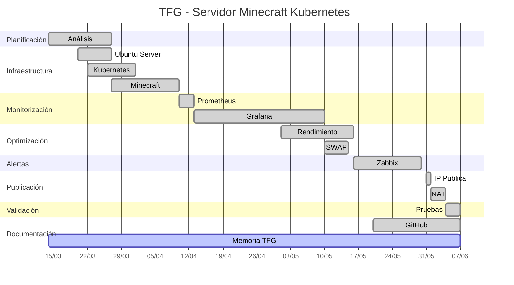

```mermaid
gantt
    title TFG - Servidor Minecraft Kubernetes
    dateFormat YYYY-MM-DD
    axisFormat %d/%m

    section Planificación
    Análisis           :done, 2026-03-14, 13d

    section Infraestructura
    Ubuntu Server      :done, 2026-03-20, 7d
    Kubernetes         :done, 2026-03-22, 10d
    Minecraft          :done, 2026-03-27, 14d

    section Monitorización
    Prometheus         :done, 2026-04-10, 3d
    Grafana            :done, 2026-04-13, 27d

    section Optimización
    Rendimiento        :done, 2026-05-01, 15d
    SWAP               :done, 2026-05-10, 5d

    section Alertas
    Zabbix             :done, 2026-05-16, 14d

    section Publicación
    IP Pública         :done, 2026-05-31, 1d
    NAT                :done, 2026-06-01, 3d

    section Validación
    Pruebas            :done, 2026-06-04, 3d

    section Documentación
    GitHub             :done, 2026-05-20, 18d
    Memoria TFG        :active, 2026-03-14, 85d
```
