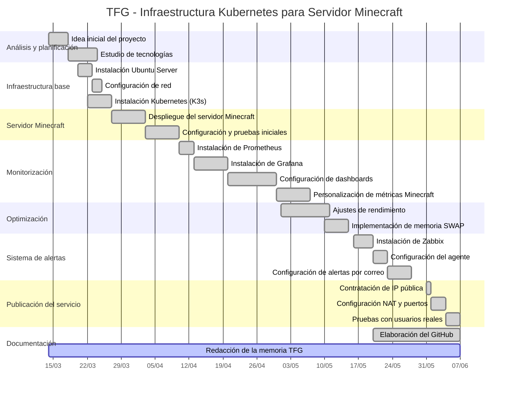

# 📅 Cronograma del Proyecto

```mermaid
gantt
    title TFG - Infraestructura Kubernetes para Servidor Minecraft
    dateFormat YYYY-MM-DD
    axisFormat %d/%m

    section Análisis y planificación
    Idea inicial del proyecto                :done, a1, 2026-03-14, 4d
    Estudio de tecnologías                   :done, a2, 2026-03-18, 6d

    section Infraestructura base
    Instalación Ubuntu Server                :done, b1, 2026-03-20, 3d
    Configuración de red                     :done, b2, 2026-03-23, 2d
    Instalación Kubernetes (K3s)             :done, b3, 2026-03-22, 5d

    section Servidor Minecraft
    Despliegue del servidor Minecraft        :done, c1, 2026-03-27, 7d
    Configuración y pruebas iniciales        :done, c2, 2026-04-03, 7d

    section Monitorización
    Instalación de Prometheus                :done, d1, 2026-04-10, 3d
    Instalación de Grafana                   :done, d2, 2026-04-13, 7d
    Configuración de dashboards              :done, d3, 2026-04-20, 10d
    Personalización de métricas Minecraft    :done, d4, 2026-04-30, 7d

    section Optimización
    Ajustes de rendimiento                   :done, e1, 2026-05-01, 10d
    Implementación de memoria SWAP           :done, e2, 2026-05-10, 5d

    section Sistema de alertas
    Instalación de Zabbix                    :done, f1, 2026-05-16, 4d
    Configuración del agente                 :done, f2, 2026-05-20, 3d
    Configuración de alertas por correo      :done, f3, 2026-05-23, 5d

    section Publicación del servicio
    Contratación de IP pública               :done, g1, 2026-05-31, 1d
    Configuración NAT y puertos              :done, g2, 2026-06-01, 3d
    Pruebas con usuarios reales              :done, g3, 2026-06-04, 3d

    section Documentación
    Elaboración del GitHub                   :done, h1, 2026-05-20, 18d
    Redacción de la memoria TFG              :active, h2, 2026-03-14, 85d
```
