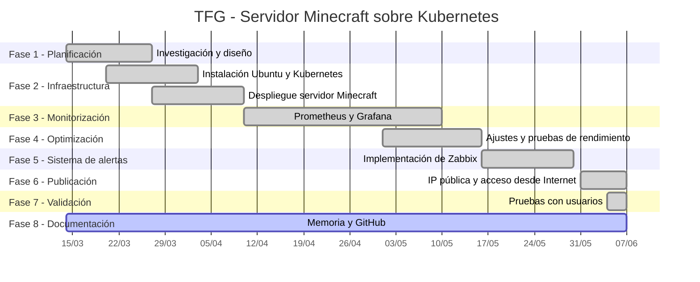

```mermaid
gantt
    title TFG - Servidor Minecraft sobre Kubernetes
    dateFormat YYYY-MM-DD
    axisFormat %d/%m

    section Fase 1 - Planificación
    Investigación y diseño                 :done, 2026-03-14, 13d

    section Fase 2 - Infraestructura
    Instalación Ubuntu y Kubernetes        :done, 2026-03-20, 14d
    Despliegue servidor Minecraft          :done, 2026-03-27, 14d

    section Fase 3 - Monitorización
    Prometheus y Grafana                   :done, 2026-04-10, 30d

    section Fase 4 - Optimización
    Ajustes y pruebas de rendimiento       :done, 2026-05-01, 15d

    section Fase 5 - Sistema de alertas
    Implementación de Zabbix               :done, 2026-05-16, 14d

    section Fase 6 - Publicación
    IP pública y acceso desde Internet     :done, 2026-05-31, 7d

    section Fase 7 - Validación
    Pruebas con usuarios                   :done, 2026-06-04, 3d

    section Fase 8 - Documentación
    Memoria y GitHub                       :active, 2026-03-14, 85d
```
    section Documentación
    Elaboración del GitHub                   :done, h1, 2026-05-20, 18d
    Redacción de la memoria TFG              :active, h2, 2026-03-14, 85d
```
